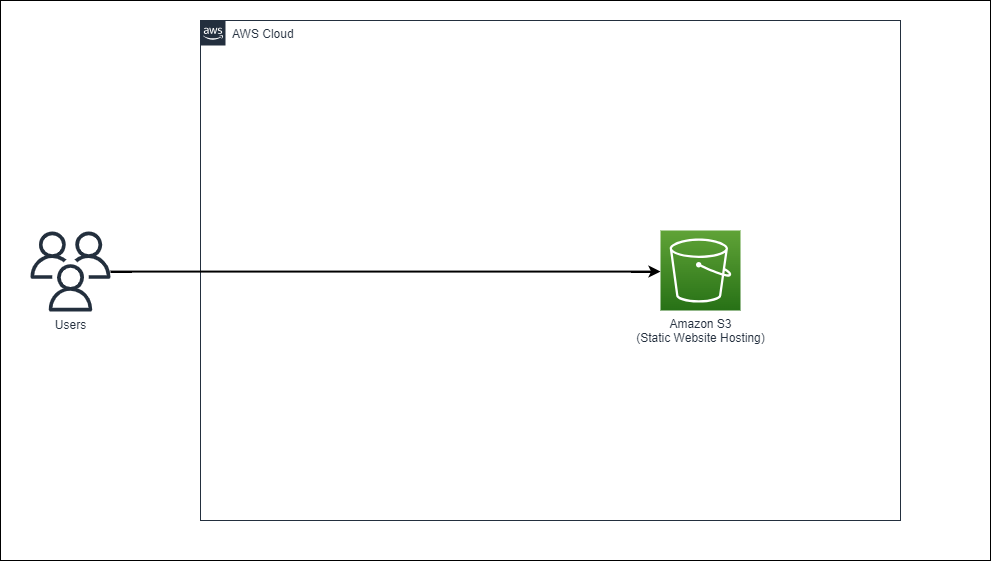

# AWS上にS3を活用した静的なWebサイトを公開する

このハンズオンではAmazon S3の静的webサイトホスティング機能を用いてAWSに簡単な静的なWebサイトを公開する。

<br>

## 使用サービス

・Amazon S3

<br>

## 構成図



<br>

## 作業内容

### S3の設定

・バケットの作成
バケット名はグローバルで一意でなければならないので注意

「ブロックパブリックアクセス」設定のみオフにする（公開する設定）

htmlファイルをアップロード

「プロパティ」-「静的ウェブサイトホスティング」を有効にする
インデックスドキュメントに格納したhtmlファイルを選択
⇒ここがアクセスした際のホームメニューになる
有効にするとウェブサイトエンドポイントが発行される(http://xxx.s3-website-ap-northeast-1.amazonaws.com)

バケットポリシーの編集

```json
{	"Version": "2012-10-17",
	"Statement": [
		{
			"Sid": "Statement1",
			"Principal": "*",
			"Effect": "Allow",
			"Action": [
				"s3:GetObject"
			],
			"Resource": [
				"arn:aws:s3:::yossy.8.7.7/*"
			]
		}
	]
}
```

ここで２点のエラー
まず１つ目がバケット作成時エラー

```
Policy has invalid resource
```

→単なるResourceで指定したバケット名間違い

２つ目が静的ウェブサイトホスティングを有効にした際に発行されたエンドポイントでアクセスするとエラー

```
403 Forbidden
Code: AccessDenied
Message: Access Denied
RequestId: 85Y85BHED9HHHX6V
HostId: Ya8BdOL7sJkvItmYbzP4a78IT63SVkZI7JCNnN4o+nlre40+jhlRKPol79N1a6cLdN/3j4qfIjw96AV47gCIwxDINxfkO5I6STmrpIXlAPc=
```

こちらはパブリックアクセスが拒否されている模様

S3は**アカウント単位でのブロックパブリックアクセス設定**がある
こちらも無効にしないとバケット単位のパブリックアクセスも無効にならない

無効に設定後アクセスに成功

`<br>`

### CloudFrontの設定

軽くCloudFrontについて
S3バケットやwebサーバーなどをオリジンサーバーとして指定することでCloudFrontがファイルをキャッシュ
世界中にあるエッジサーバーから最適な配信を行うサービス。

・ディストリビューション作成
バケットのエンドピントを指定するだけで簡単に作成が可能

キャッシュの設定はポリシーによって制御する

`<br>`

## 参照記事

[ハンズオン内容](https://pages.awscloud.com/JAPAN-event-OE-Hands-on-for-Beginners-StaticWebsiteHosting-2022-confirmation_254.html)
[S3公式ドキュメント](https://docs.aws.amazon.com/ja_jp/s3/?id=docs_gateway)
[CloudFront公式ドキュメント](https://docs.aws.amazon.com/ja_jp/AmazonCloudFront/latest/DeveloperGuide/Introduction.html)

<br>
