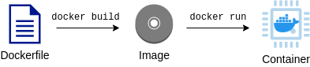

## Dockerの基本

パッケージされた１つの計算環境のことを**イメージ**とよぶ。
イメージはDocker Hubなどのリポジトリからダウンロードするか、自分で作成する

イメージを作成するためのレシピを記述したファイルを**Dockerfile**

起動状態にある計算環境のことを**コンテナ（Container）**



dockerイメージ一覧
```
docker images
```

dockerイメージの起動
```docker
docker run -it labc_v2
```

dockerコンテナ一覧
```
docker ps
```

